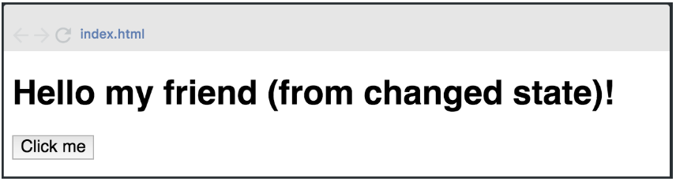

# React + Vite

This template provides a minimal setup to get React working in Vite with HMR and some ESLint rules.

## Trabajo Práctico React

### Ejercicio 3

3. Hello world (parte 3) - Dificultad: 🟢

Modificar el programa anterior agregando al componente un state con la clave msj: “(from changed state)”, además agregar un botón al presionar este botón (onClick), el state de la clave msj se debe mostrar por pantalla de la siguiente manera:



---

Utilizamos [React-Bootstrap](https://react-bootstrap.netlify.app/) **v2.9.0** en nuestro proyecto para incoroporar el Container, y usamos el **"bootstrap/dist/css/bootstrap.min.css"** para utilizar los estilos de Bootstrap.

---

> **IMPORTANTE:** Para ambos casos tenemos que importar estas herramientas con el **import**.

---

Además utilizamos el objeto props para mandar información (en este caso un string que sería el "my friend") desde un Componente padre (**App.jsx**) a un Componente hijo (**Titulos.jsx**).

Utilizamos un HOOK que es una función que le da habilidades extras a mi functionalComponent, una de esas es el Estado.

> 📌 useState es el nombre del Hook.

Para crear ese State uso una constante:

const=[state, setState] = useState("");

Aquí llamo a mi State con el nombre state e incializo mi variable state con un string vacío ("") para que incie sin nada, luego como segundo parámetro coloco el setState que me sirve para modificar ese state.

Luego coloco el evento onClick en mi Button para que cuando presione ese botón me cambie el State.

### Repositorio 💻

Los ejercicios se encuentran en el sgte. repositorio:
https://github.com/EmiTorres93/RCS-43i-React_exercise3

- Para clonar el Repositorio:

```bash
git clone https://github.com/EmiTorres93/RCS-43i-React_exercise3
```

- Para contribuir con el proyecto ponerse en contacto con el sgte. mail: **emiliana.mt93@gmail.com**

## Autores

1. Emiliana M. Torres [GitHub](https://github.com/EmiTorres93)
